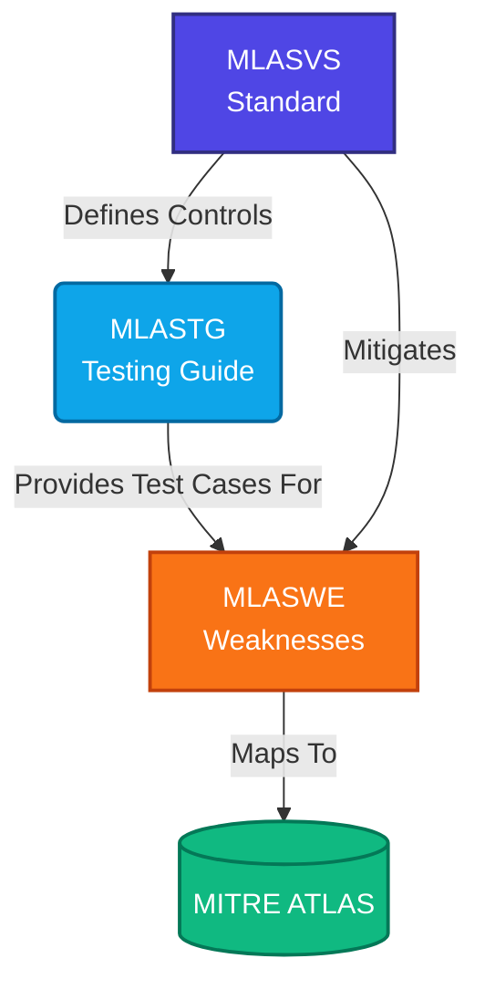

# Quick Start Guide

Welcome to the **MLSec Application Security Testing Guide (MLASTG)** framework! This standard provides a comprehensive, rigorous approach to securing Machine Learning and LLM systems.

If you are a security engineer, penetration tester, or ML developer looking to secure your AI systems, this guide will help you navigate the framework.

## Architecture of the Framework

The MLASTG framework is divided into three interconnected pillars. They work together to define security requirements, classify vulnerabilities, and provide verifiable test cases.

### 1. MLASVS (Machine Learning Application Security Verification Standard)
The **MLASVS** defines the baseline and defense-in-depth security controls required to build secure ML systems.
- **L1 (Standard):** Baseline controls for all ML systems.
- **L2 (Defense-in-Depth):** Advanced controls for critical, high-risk, or public-facing systems.

*Where to start:* Read the [MLASVS Categories Overview](MLASVS/0x02-MLASVS-Categories.md) to understand the 7 core security domains (Data, Model, LLM, Supply Chain, Pipeline, Infra, Governance).

### 2. MLASTG (Testing Guide)
The **MLASTG** provides the exact, step-by-step procedures to verify that the MLASVS controls are implemented correctly.
- Includes prerequisites, attack emulation procedures, expected results, and remediation guidance.
- Uses tools like IBM ART, Garack, and custom Python scripts.

*Where to start:* Read the [Testing Methodology](MLASTG/0x00-Testing-Methodology.md) and review the [Testing Tools](MLASTG/0x01-Testing-Tools.md).

### 3. MLASWE (Weakness Enumeration)
The **MLASWE** enumerates the specific weaknesses and vulnerabilities that occur when MLASVS controls are missing or fail.
- Defines attack mechanics (e.g., Prompt Injection, Membership Inference).
- Provides tactical mitigations.

*Where to start:* Read the [MLASWE Introduction](MLASWE/0x00-Introduction-Weaknesses.md).

---

## How to Conduct an Assessment

1. **Scope the Application:** Determine if the ML system is L1 (Internal/Low Risk) or L2 (External/High Risk).
2. **Review Controls:** Use the [Checklist](checklist.md) to review the MLASVS controls applicable to your scope.
3. **Execute Tests:** Follow the MLASTG test cases to verify the controls. Use the companion Python scripts located in the `/tests/` directory of the repository for automated execution.
4. **Map to ATLAS:** If vulnerabilities are found, use the [ATLAS Coverage Matrix](ATLAS-Mapping/1-Coverage-Matrix.md) to report the findings using industry-standard MITRE terminology.
